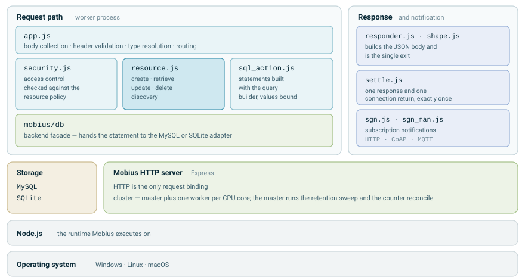
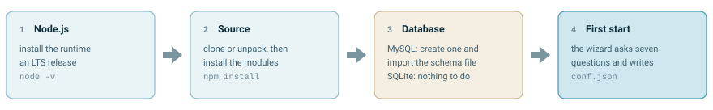

# Mobius
oneM2M IoT Server Platform

## Version
3.0.1

Mobius is actively maintained and keeps being updated. [Mobius4](https://github.com/iotketi/mobius4) is a **separate edition** of Mobius built for AI integration; it is not the successor of this project. Use Mobius for a standard oneM2M IN-CSE, and Mobius4 when you need the AI integration layer on top of oneM2M.

## Guide

**[Mobius Guide → iotketi.github.io/Mobius](https://iotketi.github.io/Mobius/)** · [한국어](https://iotketi.github.io/Mobius/) · [English](https://iotketi.github.io/Mobius/en/)

A single page per language covering the whole path from first install to daily use:

- **Introduction** — what a oneM2M IN-CSE does, how the resource tree becomes the URL, and which resource types Mobius handles
- **Architecture** — the path a request takes, how the modules divide, master and worker roles, and how the database layer hides the backend
- **Installation** — the two routes, MySQL and SQLite, and what each one needs
- **Running** — the first-start wizard, the settings commands, sealed secrets, the admin console, and what each exit code means
- **Usage** — worked `curl` examples from registering an AE through storing data, discovery, subscriptions and access control

## What's New in 3.0

Mobius 3.0 is a rewrite of the server core on the same oneM2M resource model and API. The main items:

### Database layer
- One database facade (`mobius/db/`) with two adapters: MySQL (`mysql2` driver) and SQLite. The backend is a name in `conf.json` (`db`); adding a backend is adding one adapter file.
- Every SQL statement is built with the knex query builder and executed with bound values. No string interpolation remains, which closes the discovery-parameter SQL injection reported against 2.5.15 and earlier at its root.
- A fresh MySQL install is one import of `mobius/db/mobiusdb.sql`: the file carries the tables, the indexes and the migration ledger, so nothing is left to apply by hand.
- Identifiers and names are compared byte for byte (binary collation), as oneM2M requires; `rn`, `sri` and `spi` are 200 characters wide.

### SQLite support
Mobius runs on SQLite as well as MySQL. SQLite requires no separate database server and creates its schema automatically at startup, which makes it suitable for embedded gateways, development and small deployments. Select the backend at launch (`node mobius.js sqlite`) or through the `db` option in `conf.json`. See [Configuration](#configuration).

The SQLite backend currently covers six resource types: CSEBase, AE, accessControlPolicy, container, contentInstance and subscription. Creating any other type while running on SQLite is rejected with `501 Not Implemented` (`X-M2M-RSC: 5001`) instead of being attempted, so the resource tree is never left in a partial state. Deployments that need group, flexContainer, node, remoteCSE, mgmtObj or semanticDescriptor should run on MySQL.

### Configuration
- `conf.json` is the only configuration; nothing is hard-coded in the source. `mobius/conf_schema.js` declares every key with its type, default, when it takes effect and help text.
- The first start asks seven questions and writes `conf.json`. `npm run conf` lists and edits keys; `npm run status` shows the running master, its port and the keys waiting for a restart.
- `dbpass` and `superUser` are sealed (`conf.seal.json`): they are changed through `npm run setup` only, and a hand-edited value is refused at boot.

### Request handling
- Every request is settled exactly once: one settlement function sends the response and returns the database connection, so a lost or doubled response can no longer hang a connection or crash a worker.
- Result codes live in one catalogue (`mobius/rsc.js`, `mobius/reason.js`): one HTTP status per oneM2M response status code, following TS-0009.
- JSON only. XML and CBOR request bodies are rejected with `400`; responses and notifications are always JSON.
- Request bodies are capped (`maxBodyBytes`, default 10 MB, `413` when exceeded). Resource names, structured paths and client-supplied AE-IDs are length-checked (`400`); the AE-ID format itself is not checked.
- Outgoing requests (remoteCSE forwarding, group fan-out, notifications) carry a timeout and ask for JSON.

### Discovery and identifiers
- Discovery runs as a recursive CTE for the skeleton plus batched child queries on both backends. `lim` and `ofst` are global, and a truncated result carries `X-M2M-CTS` / `X-M2M-CTO`.
- `la` / `ol` read the `(pi, ty, ct)` index directly; the time-window retry is gone.
- Short resource ids (the `ri` in responses, the `aei` of an AE) are generated unique across cluster workers and enforced UNIQUE in the database.
- Group fan-out sends member requests in parallel (at most 8 at a time) and aggregates them in member order.

### Notifications
- Subscriptions are read from the `sub` table at every write; the subscription copy on the parent resource is gone.
- Delivery is fire-and-forget over HTTP, CoAP and MQTT, in event order with no artificial delay. Every delivery is classified (`ok` / `reject` / `fail` / `unknown`) in the log together with the subscription id.
- MQTT notifications are not queued while the broker is unreachable, and broker disconnects are logged.

### Cluster and operations
- Container counters (`cni`, `cbs`) are updated by relative increment inside the contentInstance insert transaction. Retention (`mni` / `mbs`) and counter reconciliation run in the master only and count live rows before deleting anything.
- Startup failures exit instead of leaving a process without ports: missing `conf.json` (exit 13), broken seal (14), port in use (12), no database (1).
- Per-request stdout logging is gone; the request time is the last field of `log/access-*.log`. The super-user origin is never written to logs.
- A boot record (`log/mobius-boot.jsonl`) shows which configuration the running server actually applied.

### Admin console
- `admin/` is an operator console that runs as a separate process (`node admin/server.js`): expired resources, orphan rows, access control policy review and simulation, batch deletion. It uses the core database facade and the core policy tables. Configuration and process control are deliberately not part of the web UI.
- `/hit`, `/total_ae` and `/total_cbs` are no longer served by the core; the console provides them behind its session.

### Removed
- The MQTT, CoAP and WebSocket request bindings (the protocol proxies). HTTP is the only request binding; three years of traffic showed http 124,988,941 / mqtt 32 / coap 0 / ws 0.
- ASN-CSE / MN-CSE modes; the `timeSeries` / `timeSeriesInstance`, `request` and transaction (`tm` / `tr`) resource types; non-blocking requests (`rt=1` / `rt=2` are answered as unsupported); the semantic broker; the AE notification relay; subscription verification requests; WebSocket notification delivery.
- The per-worker resource cache and the legacy database paths.

### Upgrading from 2.x
1. An existing 2.x database must be brought to the 3.0 schema before the new core starts. The step-by-step schema migrations (`migrations/001` to `019`, run with `node tools/migrate.js`) are maintained on the `lite` branch, not in this release; a fresh install needs none of them because `mobius/db/mobiusdb.sql` already has the final shape.
2. Create the secret seal once: run `npm run setup -- --superuser` and press Enter (the value is kept). `--dbpass` follows the same rule.
3. In `conf.json`, `usesqlite` is replaced by `db` (`"mysql"` or `"sqlite"`). `cntManPort`, `pxyWsPort`, `pxyMqttPort`, `wsAllowedOrigins`, `sgnManPort`, `hitManPort` and `adminPm2Name` are no longer read; `npm run conf` reports unknown keys.
4. Clients using the MQTT, CoAP or WebSocket request bindings must move to HTTP; clients sending XML or CBOR must send JSON.
5. Applications relying on `timeSeries` / `timeSeriesInstance` must migrate to `container` / `contentInstance`. Applications relying on notification retry or automatic subscription removal must handle delivery reliability on their side.
6. Upgrading from 2.5 or earlier: the `cnt` counters were widened in 2.6 and existing installations must apply this change as well:
```sql
ALTER TABLE cnt
  MODIFY mni bigint unsigned NOT NULL,
  MODIFY mbs bigint unsigned NOT NULL,
  MODIFY cni bigint unsigned NOT NULL,
  MODIFY cbs bigint unsigned NOT NULL;
```

## Introduction
Mobius is the open source IoT server platform based on the oneM2M (http://www.oneM2M.org) standard. As oneM2M specifies, Mobius provides common services functions (e.g. registration, data management, subscription/notification, security) as middleware to IoT applications of different service domains. Not just oneM2M devices, but also non-oneM2M devices (i.e. by oneM2M interworking specifications and KETI TAS) can connect to Mobius.

## Certification
Mobius has been received certification of ‘oneM2M standard’ by TTA (Telecommunications Technology Association). oneM2M Certification guarantees that oneM2M products meet oneM2M Specification and Test requirements which ensure interoperability. As Mobius is certified, it will be used as a golden sample to validate test cases and testing system.

<div align="center">

</div>

TRSL (Test Requirements Status List) is available on oneM2M certification website (http://www.onem2mcert.com/sub/sub05_01.php).

## System Stucture
In oneM2M architecture, Mobius implements the IN-CSE which is the cloud server in the infrastructure domain. IoT applications communicate with field domain IoT gateways/devices via Mobius.

<div align="center">

</div>

## Connectivity Stucture
To enable Internet of Things, things are connected to &Cube via TAS (Thing Adaptation Software), then &Cube communicate with Mobius over oneM2M standard APIs. Also IoT applications use oneM2M standard APIs to retrieve thing data control things of Mobius.

<div align="center">

</div>

## Software Architecture

Mobius runs as a Node.js cluster: a master process and one worker per CPU core. Workers handle the
requests. The master handles none of them and instead runs the two periodic jobs, the retention
sweep and the counter reconcile, and restarts any worker that dies.

Inside a worker a request always takes the same path. `app.js` collects the body, validates the
headers, resolves the resource type and routes the request; `security.js` checks it against the
access policy; `resource.js` carries out the operation; and `sql_action.js` builds the statement.
The facade in `mobius/db/` then hands that statement to the adapter for whichever backend is
configured, which is why core code never mentions MySQL or SQLite by name. Every value reaches the
database as a binding.

The response leaves through `responder.js` and nowhere else, while `settle.js` guarantees that
sending it and returning the database connection each happen exactly once. Subscription
notifications are a separate path: `sgn.js` and `sgn_man.js` deliver them over HTTP, CoAP or MQTT,
depending on the address the subscriber registered.

<div align="center">
<picture>
  <source media="(prefers-color-scheme: dark)" srcset="assets/architecture-dark.svg">
  
</picture>
</div>

## Supported Protocol Bindings

| | Bindings | Notes |
|---|---|---|
| Requests | HTTP | The only request binding. The MQTT, CoAP and WebSocket bindings of 2.x (the `pxy_mqtt`, `pxy_coap` and `pxy_ws` proxies) have been removed, so a client that used one of them has to move to HTTP |
| Notifications | HTTP, CoAP, MQTT | The scheme of the subscription's `nu` decides which one is used (`http://`, `coap://`, `mqtt://`). A `ws://` address is still accepted but nothing is ever delivered to it |
| Serialization | JSON | A request body sent as XML or CBOR is refused with 400, and responses and notifications are always JSON |

An MQTT broker is therefore needed only when subscriptions deliver to `mqtt://` addresses.

## Installation
Mobius runs on Node.js and keeps its resources in MySQL or SQLite. There is no build step, so
installing it means getting the source, installing the modules, preparing the database and
starting the server once to answer the setup questions.

<div align="center">
<picture>
  <source media="(prefers-color-scheme: dark)" srcset="assets/install-order-dark.svg">
  
</picture>
</div>

| What | Needed | Why |
|---|---|---|
| [Node.js](https://nodejs.org/) | Always | The runtime Mobius executes on. An LTS release is recommended |
| [MySQL](https://www.mysql.com/downloads/) | For a real deployment | Holds every resource type and carries the installations in the field |
| SQLite | Comes with the modules | Nothing to install and no schema to import, which makes it the quickest way to try Mobius. See [SQLite support](#sqlite-support) for the resource types it covers |
| [Mosquitto](https://mosquitto.org/) | Only for MQTT notifications | Any MQTT broker will do. Skip it when notifications go over HTTP |

Get the source and install the modules:

```bash
git clone https://github.com/IoTKETI/Mobius.git
cd Mobius
npm install
```

**On MySQL, importing the schema is the whole installation.** Create one database and import
`mobius/db/mobiusdb.sql` into it. That file carries the tables, the indexes and the migration
ledger, so a new database starts in the same state as a fully migrated deployment and nothing
is left to apply by hand. The one thing a schema file cannot carry is the MySQL server
settings, and Mobius applies those itself on the first start.

```bash
mysql -u root -p -e "CREATE DATABASE mobiusdb DEFAULT CHARACTER SET utf8mb3;"
mysql -u root -p mobiusdb < mobius/db/mobiusdb.sql
```

On SQLite there is nothing to prepare at all. The store file and its tables are created the
first time the server starts.

The [guide](https://iotketi.github.io/Mobius/) covers the same installation in more detail and
also shows how to do the MySQL step with MySQL Workbench.

## Configuration
Everything Mobius reads sits in one file, `conf.json`. It is not part of the repository, so the
first start creates it: run `node mobius.js` in an interactive terminal and it asks seven
questions — database, database password, CSE name, CSE-ID, SP-ID, super-user origin and HTTP
port — writes the file and then boots.

```bash
node mobius.js         # first run: asks, writes conf.json, starts
npm run setup          # the same questions without starting the server
```

Every other setting has a default. Inspect and change them from the command line. There is no
web page for this, because `conf.json` holds the master keys.

```bash
npm run conf                        # every key, its value in the file, and whether the running server has applied it
npm run conf -- set cseBase Vita    # gated keys print a warning and ask you to type the key name
npm run conf -- edit                # walk through the user keys one by one; Enter keeps the current value
npm run conf -- --all               # advanced keys as well
npm run status                      # master pid, port, boot record, keys waiting for a restart
```

`dbpass` and `superUser` are stored in plain text, and the wizard hides them while you type. To
enter one again later, run `npm run setup -- --dbpass` or `npm run setup -- --superuser`. Both
read from a prompt and never from a command-line argument.

Those two secrets are also sealed against hand-editing. Mobius keeps `conf.seal.json` beside
`conf.json` and refuses to boot when either value has been changed in an editor. An installation
made before the seal existed does not have one yet, so run `npm run setup -- --superuser` once
and press **Enter**: the value stays as it is and the seal is created.

### Default Retention Policies (optional)
By default a container created without `mni` / `mbs` uses the Mobius defaults. If a deployment needs different defaults for particular container paths, they can be declared in `conf.json` as `retentionPolicies`. Omit the key to disable the feature entirely.

```
{
  "retentionPolicies": [
    {"match": "contains", "value": "/Simul_", "mni": "10000"},
    {"match": "regex", "value": "/\\d{4}_\\d{2}_\\d{2}_T_\\d{2}_\\d{2}$",
     "mni": "3153600000", "mbs": "1099511627776"},
    {"match": "suffix", "value": "/archive", "mni": "100000"}
  ]
}
```

- `match` — `contains` (default), `prefix`, `suffix` or `regex`, compared against the container resource identifier
- `value` — the string or JavaScript regular expression source to compare with
- `mni` / `mbs` — either may be omitted, in which case the Mobius default applies

The first matching rule wins, so array order is priority order. A rule that is malformed is reported on the console and skipped rather than blocking container creation. A value explicitly supplied by the client in the CREATE request always takes precedence over these defaults, as required by oneM2M.

## Run
```bash
node mobius.js          # npm start does the same
node mobius.js sqlite   # force SQLite for this run
node mobius.js mysql    # force MySQL for this run
```

Without an argument the backend follows the `db` key in `conf.json`.

When `conf.json` is missing and the terminal is interactive, `node mobius.js` runs the setup
questions itself. When it is missing and the output is not a terminal, which is what happens
under a service manager or when the output is redirected to a file, Mobius stops without
creating the file, and it has to be started once from a terminal instead. When the HTTP port is
already held by something else, Mobius exits with code 12 rather than respawning workers
forever.

Once it is up, `npm run status` reports the master process, the port it is listening on and any
setting that is waiting for a restart.

## Library Dependencies
`npm install` brings in everything listed in `package.json`, and nothing has to be installed by
hand. The ones that shape the server are Express for HTTP, Knex for building the statements,
`mysql2` and `sqlite3` for the two database backends, and `mqtt` and `coap` for delivering
notifications.

## Document
The full guide is published at **[iotketi.github.io/Mobius](https://iotketi.github.io/Mobius/)** in [Korean](https://iotketi.github.io/Mobius/) and [English](https://iotketi.github.io/Mobius/en/). It covers the same ground as the sections above and adds the architecture and usage material, so it is the place to start.

The legacy installation guide PDFs were removed from this repository as they no longer matched the current version.

# Author
Il Yeup Ahn (iyahn@keti.re.kr)<br/>
IoT Platform Center, Korea Electronics Technology Institute (KETI)
